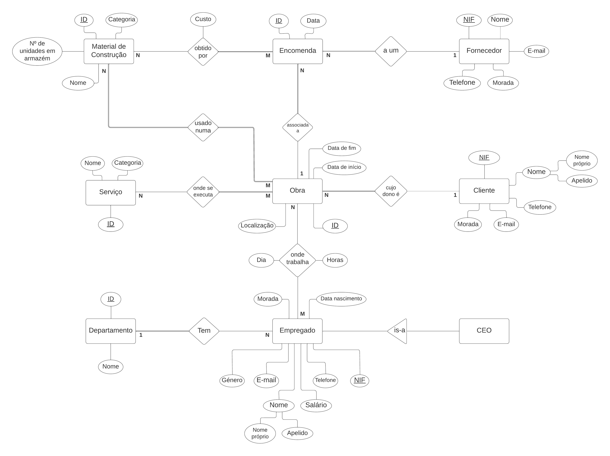

# BD: Trabalho Prático APFE

**Grupo**: P5G3
- José Gameiro, MEC: 108840
- Rúben Garrido, MEC: 107927

## Introdução / Introduction
 
Base de dados relativa à gestão de uma empresa de construção civil. Esta foca-se, sobretudo, nos empregados, nas obras e no seu material respetivo. Para além disso, existe uma gestão de encomendas aos fornecedores, caso não exista material suficiente em armazém.

## ​Análise de Requisitos / Requirements

## DER

## ER

